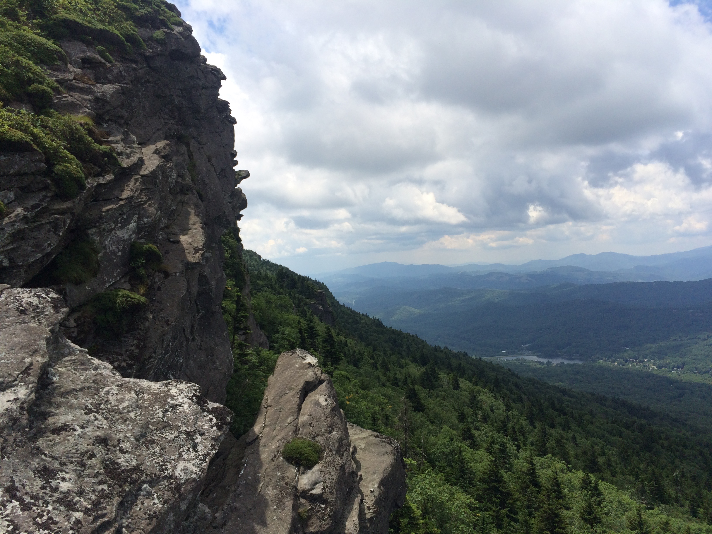

# Ryan's GitHub Profile
> ### Hi! I'm Ryan. I'm an aspiring software engineer with a passion for health, technology, & community.

<!--  -->

## Description:
> This is my GitHub profile. Click the link below to go to my GitHub Portfolio.

> [Portfolio Page](https://github.com/RyanBlount-2/RyanBlount-2.github.io)

<!-- >  -->
> 

## About Me:
> I'm a born and raised Floridian, but I currently live in the beautiful mountains of Western North Carolina. I currently work in IT, and in my free time I am striving to become a software engineer. I've learned some awesome technologies including: GitHub, Terminal, Visual Studio Code, & Atom, as well as a few cool programming languages: HTML, CSS, JavaScript, Python, & VBA. I am dedicated to learning more every day, and I love to put my abilities to the test with new projects & challenges.

## How To Reach Me:
> [LinkedIn Profile](https://linkedin.com/in/ryanblount2)  

## License:
> MIT License
>
> Copyright (c) 2022 Ryan Blount
>
> Permission is hereby granted, free of charge, to any person obtaining a copy
> of this software and associated documentation files (the "Software"), to deal
> in the Software without restriction, including without limitation the rights
> to use, copy, modify, merge, publish, distribute, sublicense, and/or sell
> copies of the Software, and to permit persons to whom the Software is
> furnished to do so, subject to the following conditions:
>
> The above copyright notice and this permission notice shall be included in all
> copies or substantial portions of the Software.
>
> THE SOFTWARE IS PROVIDED "AS IS", WITHOUT WARRANTY OF ANY KIND, EXPRESS OR
> IMPLIED, INCLUDING BUT NOT LIMITED TO THE WARRANTIES OF MERCHANTABILITY,
> FITNESS FOR A PARTICULAR PURPOSE AND NONINFRINGEMENT. IN NO EVENT SHALL THE
> AUTHORS OR COPYRIGHT HOLDERS BE LIABLE FOR ANY CLAIM, DAMAGES OR OTHER
> LIABILITY, WHETHER IN AN ACTION OF CONTRACT, TORT OR OTHERWISE, ARISING FROM,
> OUT OF OR IN CONNECTION WITH THE SOFTWARE OR THE USE OR OTHER DEALINGS IN THE
> SOFTWARE.
